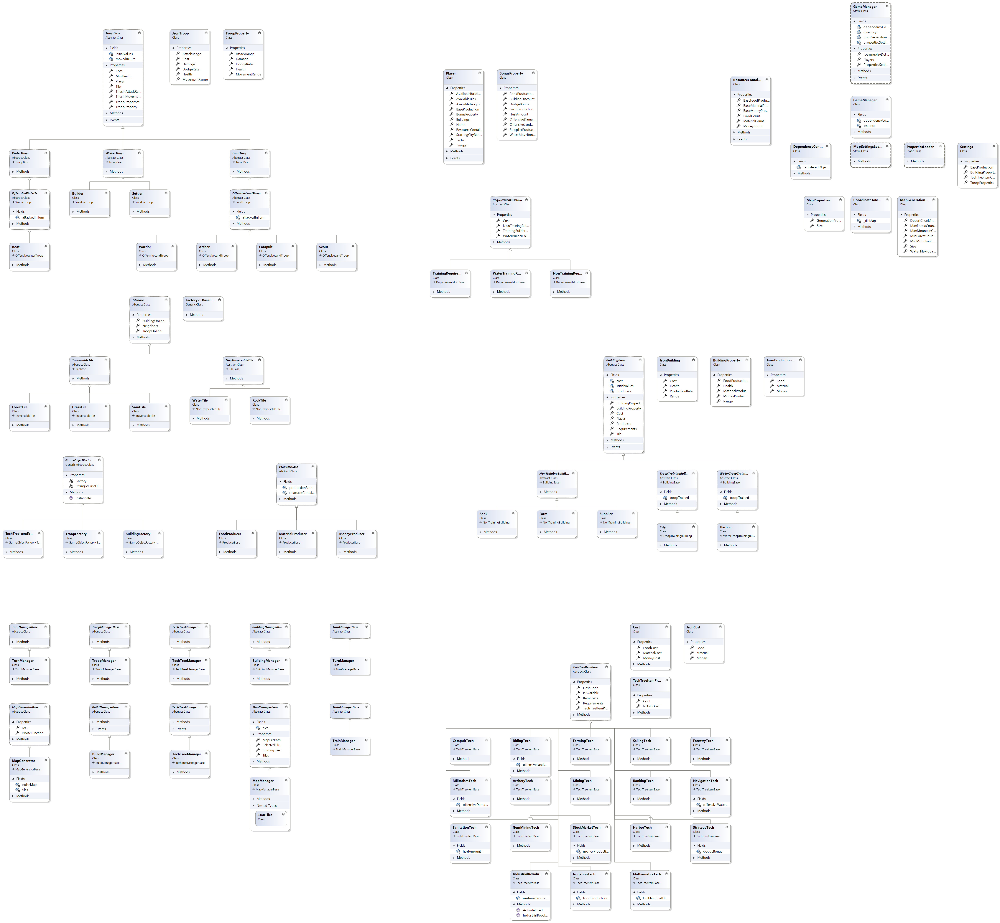
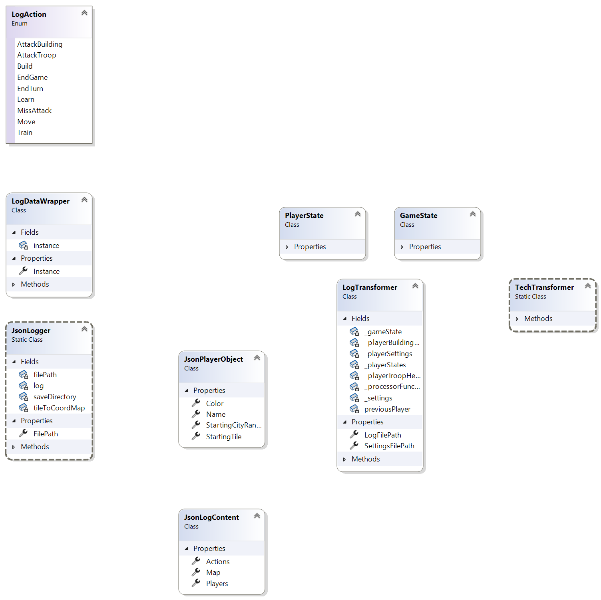
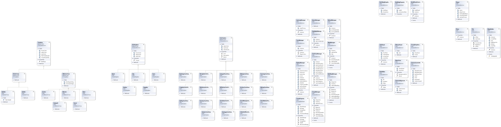

# Fejlesztői dokumentáció

Ez a dokumentum arra szolgál, hogy egy új fejlesztő könnyedén bővíthesse a játékot.
A főbb komponensekről és osztályokról egy nem kimerítő leírást hivatott nyújtani.
Amennyiben kérdés merül fel az olvasóban [ide](mailto:pasztor.kristof.kp@gmail.com) kattintva felveheti az eredeti fejlesztőkkel a kapcsolatot.

## Tartalomjegyzék

1. [Áttekintés](#áttekintés)
2. [Játék beállítása és indítása](#játék-beállítása-és-indítása)
3. [Controller és Model névterek](#controller-és-model-névterek)
4. [Konfigurálás](#konfigurálás)
5. [Naplózás](#naplózás)
6. [Játék bővítése új egységekkel](#játék-bővítése-új-egységekkel)
7. [Játék bővítése új épületekkel](#játék-bővítése-új-épületekkel)
8. [RequirementsList osztály](#requirementslist-osztály)
9. [Játék bővítése új technológiákkal](#játék-bővítése-új-technológiákkal)
10. [Játék bővítése új típusú mezőkkel](#játék-bővítése-új-típusú-mezőkkel)
11. [Játék bővítése új nyersanyaggal és nyersanyag termelővel](#játék-bővítése-új-nyersanyaggal-és-nyersanyag-termelővel)
12. [Projekt áttekintő nézete](#projekt-áttekintő-nézete)

## Áttekintés

A játék logikája a [`GameCore`](/GameCore/) könyvtárban található.
Az itt található projekt egy osztálykönyvtár, amit önmagában nem tudunk futtatni.

Használatra, illetve megjelenítési réteg definiálásra példát a [`Polytopia Clone`](/Polytopia%20Clone/) és [`Network`](/Network/) könyvtárakban találhatunk.

## Játék beállítása és indítása

Annak érdekében, hogy indíthassunk egy játékot, szükséges lesz egy pálya betöltésére.
A pálya formátumára később térünk ki, a betöltéshez a lentihez hasonlót kell írni.
```cs
Controller.GameManager.NewGameWithSavedMap(mapFilePath);
```

Természetesen arra is van lehetőség, hogy a pályát generáljuk.
Ehhez viszont szükség van valamiféle külső szolgáltatásra, ami képes egy természetes hatást keltő zajt készíteni (pl. Perlin-zaj).
Ezt az alábbi módon tudjuk beállítani.
```cs
Model.GameManager.Get<Model.MapGeneratorBase>().NoiseFunction = SomeNoiseFunction;
Controller.GameManager.NewGame();
```

Ezek után játékosokat is szükséges felvenni.
Mivel a Model összes eleme eléri a dependency containert, ezért a példányosításon kívül nincs több dolgunk ezzel.
```cs
var player = new Model.Player("Alice");
```

Ezek után akár el is indíthatjuk a játék ciklust.
Ehhez a lenti hívást használhatjuk.
```cs
Controller.GameManager.StartNew();
```

## Controller és Model névterek

A szemfülsek észrevehették, hogy két névteret használtunk a beállításkor.
Egy Façadeot építettünk a Model felé, hogy kevésbé legyen komplikált a hívóknak kiigazodni.
A Façade sok dolgot automatikusan megold, ezért csak a beállítás során szükséges a Model névtérben található osztályok explicit használata.
Minden más utasítást a Façadeon keresztül tudunk kiadni, az itt található osztályok segítségével vezéreljük a játékot, illetve a játékosokat.

## Konfigurálás

Az egységek életét, mozgási távolságát, sebzési távolságát, az épületek életét, árát egy külső json fájlba tudjuk megadni.
Ennek a formájára és tartalmára a [`PropertiesSettings.json`](/Polytopia%20Clone/GameSettings/PropertiesSettings.json) fájlban találunk példát.

Amennyiben a pályát generálni szeretnénk, szükség van egy másik konfigurációs fájlra.
Ehhez példát a [`MapGenerationSettings.json`](/Polytopia%20Clone/GameSettings/MapGenerationSettings.json) fájlban találunk.

## Naplózás

Az egyes játékokban történt összes esemény naplózására is van lehetőségünk.
Ennek a megvalósítása a [`Log`](/Log/) könyvátrban tekinthető meg.
Maga a folyamat teljesen automatikusan történik és minimális beállítást igényel, ezt lentebb láthatjuk.
```cs
JsonLogger.Init();
```

A naplófájlok automatikusan generálódnak.
A fájlok nevei az egyes játékok kezdeti időpontjai.
Egy logjál lehetséges tartalmára alább láthatunk példát.
```json
{
  "Map": "useMapFilepath",
  "Players": [
    {
      "Name": "Bob",
      "Color": [],
      "StartingTile": [
        4,
        1
      ],
      "StartingCityRange": 0
    },
    {
      "Name": "Alice",
      "Color": [],
      "StartingTile": [
        1,
        10
      ],
      "StartingCityRange": 0
    }
  ],
  "Actions": [
    {
      "Name": "Alice",
      "Action": "Train",
      "Parameters": {
        "Start": [
          1,
          10
        ],
        "End": [],
        "Neighbors": [],
        "Tech": "",
        "Building": "",
        "Troop": "Builder"
      }
    },
    {
      "Name": "Alice",
      "Action": "Move",
      "Parameters": {
        "Start": [
          1,
          10
        ],
        "End": [
          2,
          10
        ],
        "Neighbors": [],
        "Tech": "",
        "Building": "",
        "Troop": ""
      }
    },
    {
      "Name": "Alice",
      "Action": "Build",
      "Parameters": {
        "Start": [
          2,
          10
        ],
        "End": [],
        "Neighbors": [],
        "Tech": "",
        "Building": "Supplier",
        "Troop": ""
      }
    },
    {
      "Name": "Alice",
      "Action": "EndTurn",
      "Parameters": {
        "Start": [],
        "End": [],
        "Neighbors": [],
        "Tech": "",
        "Building": "",
        "Troop": ""
      }
    },
    {
      "Name": "Bob",
      "Action": "EndTurn",
      "Parameters": {
        "Start": [],
        "End": [],
        "Neighbors": [],
        "Tech": "",
        "Building": "",
        "Troop": ""
      }
    }
  ]
}
```
Minden naplófájl első bejegyzése a játékhoz használt pálya fájl elérési útvonala.
Ezt követi az egyes játékosok nevei és kezdő városaik koordinátái.
Megjegyezném, hogy a `Color` mező nem kerül felhasználásra, kompatibilitási okok miatt nem töröltük.
Ezek után következnek az egyes események. Ezek formailag mindig azonosak, de a cselekvés típusától függően más paraméterek vannak kitöltve.
Természetesen a nem használt paraméterek is kitölthetőek, csak a használtak kerülnek majd értelmezésre, amikor vissza szeretnénk nézni a lejátszott játékot.
Az elérhető parancsokról, illetve ezek használatáról a [`README.md`](/README.md) fájlban bővebben értekezünk.

A naplófájlokat Unityben tudjuk felhasználi, hogy grafikus formában is visszanézhessük a fájlokban leírt játékokat.

## Játék bővítése új egységekkel

Úgy készíthetünk új egységet, ha leszármazunk a `TroopBase` osztályból.
Van további három leszármazottja az előbbi osztálynak: `LandTroop`, `WaterTroop` és `WorkerTroop`.
Érdemes ezeket használni, mert a funkciók nagy része már meg van bennük valosítva.
A következőkben a három leszármazottról olvashatunk bővebben.

A `LandTroop` osztályból szárazföldi egységek készítésekor érdemes leszármazni, viszont ez az osztály csak a szárazföldi mezőkön való mozgást biztosítja. Ha szeretnénk, hogy az újonnan létrehozott egység támadni is tudjon, akkor érdemes hasznáni az osztály újabb leszármazottját, az `OffensiveLandTroop` osztályt. Ebben felül vannak definiálva a támadáshoz szükséges metódusok. Ha szeretnénk saját támadási stílust, mint ami például a `Catapult` osztálynak van, akkor a készített osztályban az `Attack(TroopBase troop)`, valamint az `Attack(BuildingBase building)` metódusokat érdemes felüldefiniálni. Amit viszont mindenképpen szükséges elvégezni, az az osztály konstruktora, mivel itt szükséges beállítani az egységre vonatkozó különböző paramétereket, melyeket érdemes felvenni a konfigurációs fájlba, ezt követően onnan betölteni. Emellett szükséges az osztály `ToString()` metódusát is felülírni, mivel erre szükség van bizonyos funkciók, például a logolás esetén.
Az `OffensiveLandTroop` osztályba egyébként az `Archer`, a `Catapult`, a `Scout`, valamint a `Warrior` tartozik.

A `WaterTroop` osztályból vízi egységek készítésekor érdemes leszármazni, viszont ez az osztály csak a vízi mezőkön való mozgást biztosítja. Ha szeretnénk, hogy az újonnan létrehozott egység támadni is tudjon, akkor érdemes hasznáni az osztály újabb leszármazottját, az `OffensiveWaterTroop` osztályt. Itt - hasonlóan az `OffensiveLandTroop` osztályhoz - az `Attack` metódusok felüldefiniálásával lehet új típusú támadást implementálni, ha viszont megfelelő a beépített támadási mechanizmus akkor itt is szintén csak a tulajdonságok konfigurációs fájlba való bejegyzése, konstruktorban való beállítása, valamint a `ToString` metódus felüldefiniálása szükséges.
Az `OffensiveWaterTroop` osztályba tartozik egyébként a `Boat`.

A `WorkerTroop` osztályból akkor érdemes leszármazni, ha szeretnénk létrehozni valamilyen speciális funkcióval rendelkező, passzív egységet. Mivel passzív, így támadni nem tud (egyébként az ősosztály szerint ez az alapértelmezett), viszont a `WorkerTroop` leszármazottak alapértelmezetten minden típusú mezőre tudnak lépni. Ami itt is fontos, az a tulajdonságok konfigurációs fájlba való bejegyzése, konstruktorban való beállítása, valamint a `ToString` metódus felüldefiniálása. Emellett szükség van a `FillRequirements()` metódus felüldefiniálására (lásd [RequirementsList osztály](#requirementslist-osztály)), itt megadható, hogy az egység mit tud csinálni és mit nem.
A `WorkerTroop` osztályba tartozik egyébként a `Builder`, valamint a `Settler`.

Az egységek különböző mezőkre való lépését a `Relocate()` metódusok felüldefiniálásával lehet változtatni, azt pedig, hogy milyen mezőkön lehet őket kiképezni a `Train()` metódusok különböző implementációi adják. Ha közvetlenül a `TroopBase` osztályból származunk le, akkor mindenképpen szükséges ezek felüldefiniálása, mivel absztrakt metódusok.

## Játék bővítése új épületekkel

Úgy készíthetünk új épületet, ha leszármazunk a `BuildingBase` osztályból.
Van további három leszármazottja az előbbi osztálynak: `NonTrainingBuilding`, `TroopTrainingBuilding` és `WaterTroopTrainingBuilding`.
Érdemes ezeket használni, mert a funkciók nagy része már meg van bennük valosítva.
Új épület típus létrehozásakor a konfigurációs fájlba is fel kell venni az épület beállításait a már meglévő épületekhez képes teljesen azonos formában.
A következőkben a három leszármazottról olvashatunk bővebben.

A `NonTrainingBuilding` osztály, mint neve is sugallja azoknak az épületeknek az őse, amik nem tudnak egységeket kiképezni.
Ilyen épületek a `Bank`, `Farm` és `Supplier`.
Ezek sablonként is használhatók, amikor új épületeket hozna valaki létre.
Azt, hogy mi mennyit termel a leszármazottban kell beállítani konstruktorban, célszerűen a konfigurációs fájlok alapján, tehát oda is fel kell explicit venni az új épület beállításait.
Amennyiben szeretnénk lehetőséget biztosítani arra, hogy futásidőben többet termeljenek az efféle épületek, az `IncreaseXXXProduction(int amount)` metódust kell felüldefiniálni.
Az `XXX` helyen a három alap nyersanyag bármelyike állhat: `Food`, `Material`, `Money`.

A `TroopTrainingBuilding` osztály azoknak az épületeknek az őse, amik valamilyen szárazföldi egységet tudnak kiképezni.
Ilyen épület a `City`.
Ez sablonként is használható, amikor új épületeket hozna valaki létre.
Az épület beállításait itt is a konstruktorban kell elvégezni.
Ahhoz, hogy új egységet hozhassunk létre és az alap viselkedésen túl szeretnék plusz funkciókat adni az épülethez a `TrainTroop(TroopBase troop)` metódust kel felüldefiniálni.
Ennek a metódusnak igazzal kell visszatérnie, ha sikerült kiképezni az egységet, különben hamissal.

A `WaterTroopTrainingBuilding` osztály azoknak az épületeknek az őse, amik valamilyen vizi egységet tudnak kiképezni (egyelőre ilyen egység kizárólag a `Boat`).
Ilyen épület a `Harbor`.
Ez sablonként is használható, amikor új épületeket hozna valaki létre.
Az épület beállításait konstruktorban kell elvégezni.
Ahhoz, hogy új egységet hozhassunk létre és az alap viselkedésen túl szeretnénk plusz funkciókat adni az épülethez a `TrainTroop(TroopBase troop)` metódust kel felüldefiniálni.
Ennek a metódusnak igazzal kell visszatérnie, ha sikerült kiképezni az egységet, különben hamissal.

Minden épületnek van egy `RequirementsList` (lásd [RequirementsList osztály](#requirementslist-osztály) című fejezet) példánya, amit az egységek, illetve a játékos készlete tölthetnek ki.
Egy épületet csak akkor lehet megépíteni, ha a listát hiánymentesen ki tudták tölteni.

## RequirementsList osztály

A `RequirementsList` osztály minden `BuildingBase` osztályban megjelenik.
Ennek különösen fontos szerepe van az építkezésben.
Minden épület típusnak szüksége van a lehetséges követelmények egy részhalmazára.
Az elérhető követelményeket a `RequirementsListBase` osztályban tekinthetjük meg.
Ez által teljesen áttetsző módon tudjuk ugyanúgy kezelni az összes épületet, hiszen mind tudja saját magáról, hogy milyen előkövetelményei vannak a megépítésnek.
Sőt így az épületekhez tartozó osztályok módosítása nélkül változtathatóak és módosíthatóak a követelmény listák.
Amennyiben valamilyen újfajta követelményt szeretnénk felvenni, a `RequirementsListBase` osztályban ezt megtehetjük.
Erre jó sablonnak szolgálhatnak a `TrainingBuilderFound`, `NonTrainingBuilderFound`, `WaterBuilderFound` és `Cost` propertyk.
Természetesen az új követelményeket valamilyen más osztálynak ki kell tudnia tölteni.
Ezt az egységek esetén a `FillRequirements(RequirementsListBase requirements)` metódus felüldefiniálásval tehetjük meg.
Erre példát többek között a `Builder` osztályban láthatunk.
A listát a rajtuk álló egységek, illetve a játékosnál lévő nyersanyag tartalékok töltik ki.

## Játék bővítése új technológiákkal

Új technológia készítéséhez le kell származnunk a `TechTreeItemBase` osztályból. Ezt követően fel kell vennünk a konfigurációs fájlba a technológiához tartozó `Cost` tulajdonságokat, valamint beállítani a konstruktorban. Emellett a konstruktorban meg kell adni a technológia `HashCode` property mezőjét, ami minden tech számára egyedi kell legyen. Az `ActivateEffect` metódus felüldefiniálásával adható meg, hogy pontosan mit csinál a technológia. A jelenlegi technológiák három fő csoportba tartoznak. 

Az első az *unlock* típusúak, ezek valamilyen egységet vagy épületet tesznek elérhetővé. Ilyen technológia készítéséhez az `ActivateEffect` metódusban tudjuk hozzáadni a játékos megfelelő listájához az elérhetővé tett entitást. Ilyen például az `ArcheryTech`, a `FarmingTech`, stb.

A második a *bonus* típusúak, ezek egységek vagy épületek adott tulajdonságát változatják meg. Ilyen technológia készítéséhez az `ActivateEffect` metódusban a játékos `BonusProperty` property mezőit lehet beállítani. Szükség esetén ezt az osztályt bővíteni is lehet további mezőkkel. Ebbe a csoportba tartozik például a `NavigationTech`, a `StrategyTech`, stb.

A harmadik csoport az *extending* típusúak, amelyek valamilyen funkciót bővítenek ki, ilyen például a `MiningTech` vagy a `GemMiningTech`. Ezek használatához tipikusan függvényeket kell felüldefiniálni, vagy létrehozni, ilyenek például a `Supplier` osztály `CheckTechRequirement()` metódusai.

A maradék technológia valamilyen egészen specifikus működést tesz lehetővé, például a `SanitationTech`, ami az egységek életének visszatöltését teszi lehetővé, egy ilyen tech készítése tipikusan új metódusok felvételével, valamint valamilyen esemény bevezetésével és az arra való feliratkozással jár.

## Játék bővítése új típusú mezőkkel

Ha újfajta mezőt szeretnénk létrehozni, akkor a `TileBase` osztályból kell leszármazni.
Természtesen ehhez is találunk már előre elkészített leszármazottakat, amik jó kiindulási alapként szolgálhatnak: `NonTraversableTile` és `TraversableTile`.
A `NonTraversableTile` osztályt azok a mezők valósítják meg, amelyeken a szárazföldi egységek nem tudnak átkelni.
Ilyen osztályok a `WaterTile` és `RockTile`.
A `TraversableTile` osztály azoknak a mezőknek az őse, amiken szárazföldi egységek át tudnak, vizi egységek nem tudnak átkelni.
Ilyen osztályok a `ForestTile`, `GrassTile` és `SandTile`.

A `TileBase` osztálynak három metódusa van, amire a fentebb említett osztályokban láthatunk lehetséges implementációkat.
Ugyanakkor külön ki szeretnénk térni ezekre.

A `SetBuildingOnTop(BuildingBase buildingOnTop, Player player)` metódusban tudjuk beállítani, hogy milyen épület kerüljön a mezőre.
Amennyiben nem szeretnénk semmilyen épületet megengedni, térjünk vissza hamissal.
Minden más egyedi logikát az épületek elhelyezésére itt kell megvalósítani.

A `TrainTroop(TroopBase troop)` metódusban tudjuk megkérni a mezőt, hogy képződjön ki rajta a paraméterül megkapott egység.
Amennyiben nem szeretnénk semmilyen egység kiképzését megengedni, térjünk vissza hamissal.
Minden más egyedi logikát itt kell megvalósítani.
Ugyanakkor ne felejtsük el, hogy egy mezőn egy katona állhat, erre számos komponens számít, elsősorban a naplózást megvalósító osztályok, illetve a hálózati játékot biztosítók.

Az `AcceptTroop(TroopBase troop)` metódusban tudjuk beállítani, hogy melyik egység kerüljön a mezőre.
Amennyiben nem szeretnénk semmilyen egységet megengedni, térjünk vissza hamissal.
Minden más egyedi befogadási logikát itt kell megvalósítani.

## Játék bővítése új nyersanyaggal és nyersanyag termelővel

Új nyersanyag termelő felvételéhez, mint amilyen a `FoodProducer`, a `MaterialProducer`, valamint a `MoneyProducer`, akkor szükség van a `ProducerBase` ősosztályból való leszármazásra, majd ezt követően felül kell definiálni a `Produce()` metódusát. Az ősosztály tartalmaz egy `ResourceContainer` típusú property-t, ebbe az osztályba kell felvennünk az újonnan létrehozott nyersanyag termelőt a hozzá tartozó `BaseXXXProduction` property-vel, valamint tárolnunk kell az aktuális mennyiséget az `XXXCount` property-be. A `HasEnoughFor()` és az `operator-` metódusok módosításával, vagy új metódusok hozzáadásával pedig beköthetjük az új nyersanyagot a játékba.

## Projekt áttekintő nézete
### Játéklogika


### Naplózás


### Unity
